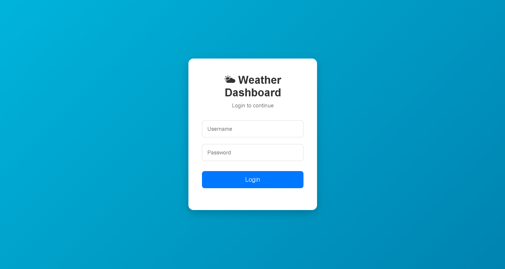
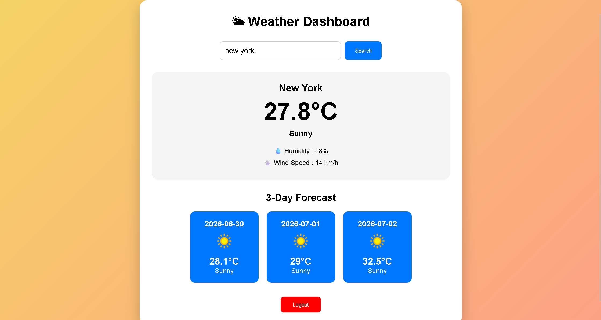

# 🌦️ Weather Dashboard Project

A modern and responsive Weather Dashboard built using **HTML, CSS, and JavaScript**. The application includes a secure login system using a local JSON file and displays real-time weather information with a 3-day forecast using the WeatherAPI.

---

## 🚀 Features

- 🔐 Login Authentication using `users.json`
- 🌍 Search Weather by City
- 🌡️ Real-Time Temperature
- 🌤️ Weather Condition with Icons
- 💧 Humidity Information
- 💨 Wind Speed Display
- 📅 3-Day Weather Forecast
- 🎨 Dynamic Background Based on Weather
- 🚪 Logout Functionality
- 💾 User Session using Local Storage
- 📱 Responsive Design
- ⚡ Weather data fetched using Fetch API and Async/Await

---

## 🛠️ Technologies Used

- HTML5
- CSS3
- JavaScript (ES6)
- Fetch API
- Local Storage
- WeatherAPI

---

## 📁 Project Structure

```
Weather-Dashboard/
│
├── index.html
├── dashboard.html
│
├── css/
│   ├── style.css
│   └── dashboard.css
│
├── js/
│   ├── login.js
│   └── dashboard.js
│
├── data/
│   └── users.json
│
├── images/
│
├── README.md
└── .gitignore
```

---

## 👤 Demo Login Credentials

| Username | Password |
|----------|----------|
| admin | password123 |
| student | jsbasic2026 |

---

## 🔑 WeatherAPI Setup

1. Create a free account at **https://www.weatherapi.com/**
2. Generate your API Key.
3. Open:

```
js/dashboard.js
```

4. Replace:

```javascript
const apiKey = "YOUR_WEATHERAPI_KEY";
```

with your own API key.

---

## ▶️ How to Run

1. Clone the repository

```bash
git clone https://github.com/harsehaj8532beaift24-crypto/Weather-Dashboard-Project.git
```

2. Open the project in **Visual Studio Code**.

3. Replace the WeatherAPI key in `js/dashboard.js`.

4. Install the **Live Server** extension (if not installed).

5. Right-click `index.html` and choose **Open with Live Server**.

6. Login using the demo credentials and search for any city.

---

## 📸 Screenshots

### 🔐 Login Page



---

### 🌤️ Weather Dashboard



---

## 📌 Future Improvements

- 🌙 Dark Mode
- 📍 Detect Current Location
- ⭐ Save Favorite Cities
- 🕒 Hourly Weather Forecast
- 🌍 Weather Maps
- 🌬️ Air Quality Index
- 📊 Weather Charts
- 🔔 Weather Alerts

---

## 📄 License

This project was developed for educational purposes as part of a Web Development assignment.

---

## 👨‍💻 Author

**Harsehaj Singh**

GitHub: https://github.com/harsehaj8532beaift24-crypto

Repository: https://github.com/harsehaj8532beaift24-crypto/Weather-Dashboard-Project